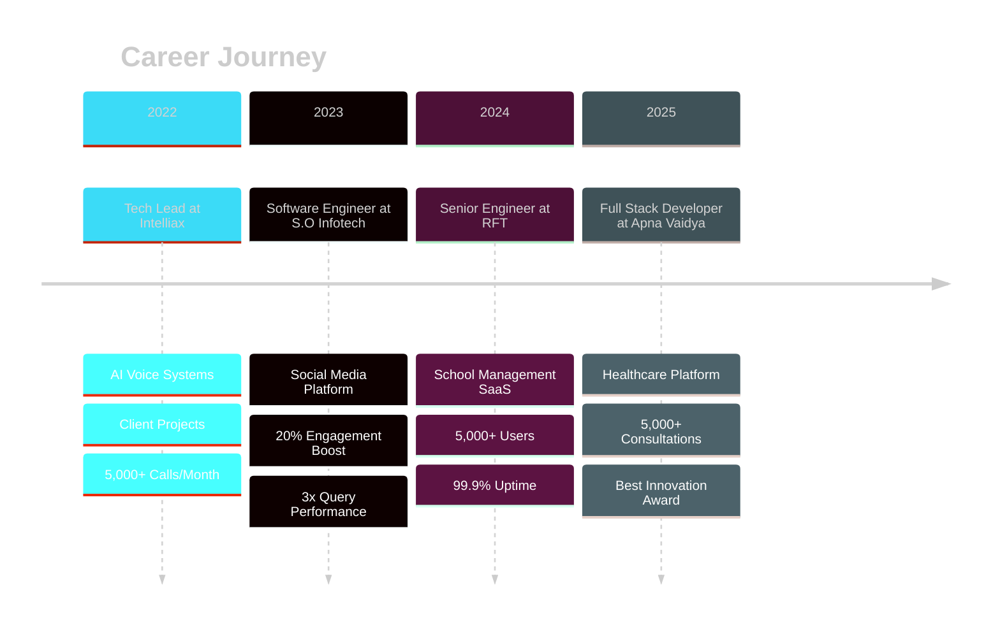

<div align="center">
  
</div>

<div align="center">
  
  [](https://git.io/typing-svg)
  
  <br/>
  
  [](mailto:kunal18jakhar@gmail.com)
  [](www.linkedin.com/in/kunal-jakhar-1a969a2b3)
  [](https://github.com/kunaljakhar)
  [](https://www.google.com/maps/place/New+Delhi)
  
  
  
</div>

---

## 👨‍💻 About Me

```typescript
const Kunal = {
  title: " Full Stack Developer",
  location: "New Delhi, India 🇮🇳",
  focus: ["Full Stack Development", "Cloud Architecture", "AI Integration"],
  
  // currentlyWorkingOn: {
  //   company: "Apna Vaidya",
  //   role: "Full Stack Developer",
  //   project: "Cross-platform Tele-consultation App",
  //   impact: "5,000+ patient-doctor interactions",
  // },
  
  // quickStats: {
  //   usersSupported: "5,000+",
  //   systemUptime: "99.9%",
  //   aiCallsPerMonth: "5,000+",
  //   deploymentSuccessRate: "99.9%",
  // },
  
  passionate_about: [
    "Building scalable microservices architectures",
    "Optimizing application performance",
    "Implementing AI-driven automation",
    "Cloud-native solutions on AWS",
  ],
  
  currentlyLearning: ["DSA", "Machine Learning ", "Deep Learning"],
  askMeAbout: ["React", "Node.js", "AWS", "System Design", ],
  // funFact: "I reduced deployment time from 2 hours to 15 minutes! ⚡",
};
```

<div align="center">
  
  ### 🎯 **What I Bring to the Table**
  
</div>

<!-- - 🏗️ **Architecting Production Systems**: Built and deployed enterprise SaaS platforms serving **5,000+ active users** with **99.9% uptime**
- ⚡ **Performance Optimization**: Achieved **3x faster database response times** and **50% improvement in app load times**
- 🤖 **AI Integration**: Developed voice automation systems handling **5,000+ monthly calls** with **95% accuracy**
- ☁️ **Cloud Architecture**: Expert in AWS services (EC2, S3, Lambda, RDS, CloudWatch) with proven scalability
- 🚀 **CI/CD Mastery**: Reduced deployment times from hours to minutes with automated pipelines
- 👥 **Technical Leadership**: Led cross-functional teams in delivering complex, multi-tenant applications

--- -->

## 🛠️ Tech Stack & Expertise

<details open>
<summary><b>💻 Frontend Development</b></summary>
<br/>

<div align="center">


**Styling & UI Frameworks**


<!--  -->

</div>

<!-- **Key Achievements:**
- Built cross-platform apps with **React Native** serving **5,000+ users**
- Optimized React apps achieving **50% improvement in load times**
- Implemented server-side rendering with **Next.js** for enhanced SEO and performance
- Designed responsive, mobile-first UIs with **WCAG 2.1 AA accessibility compliance** -->

</details>

<details open>
<summary><b>⚙️ Backend Development</b></summary>
<br/>

<div align="center">


<!--  -->
<!--  -->

<!-- 
 -->

</div>

<!-- **Key Achievements:**
- Designed **RESTful APIs** serving **10,000+ daily requests** with **sub-100ms response times**
- Built real-time prescription systems with **WebSockets**, reducing processing time by **40%**
- Implemented microservices architecture for **multi-tenant SaaS platforms**
- Engineered **GraphQL endpoints** improving data fetching efficiency by **45%** -->

</details>

<details open>
<summary><b>🗄️ Databases & Caching</b></summary>
<br/>

<div align="center">

<!--  -->


<!-- 

 -->

<!-- **ORMs & Query Builders**


 -->

</div>

<!-- **Key Achievements:**
- Optimized MySQL queries achieving **3x faster response times** under peak load
- Restructured database schemas with proper indexing and caching layers
- Implemented Redis caching strategies reducing database load by **60%**
- Designed scalable NoSQL schemas for high-throughput applications -->

</details>

<!-- <details open>
<summary><b>☁️ Cloud & DevOps (AWS Specialist)</b></summary>
<br/>

<div align="center">

**AWS Services** -->

<!-- 


 -->

<!-- **Container & Orchestration**


 -->

<!-- **CI/CD & Automation**


 -->

<!-- **Monitoring & Observability**


</div> -->

<!-- **Key Achievements:**
- **AWS Certified Solutions Architect** with hands-on production experience
- Implemented infrastructure monitoring achieving **99.9% uptime** with CloudWatch
- Built CI/CD pipelines reducing deployment time from **2 hours to 15 minutes**
- Achieved **99.9% deployment success rate** with automated GitHub Actions workflows
- Managed containerized applications with Docker and Kubernetes for scalability

</details> -->

<details open>
<summary><b>🤖 AI/ML & Automation</b></summary>
<br/>

<div align="center">


<!--  -->

<!--  -->


<!--  -->

<!-- **Voice AI & Conversational**


 -->

</div>

**Key Achievements:**
- Developed **AI-powered voice assistant** handling **5,000+ monthly calls** with **95% accuracy**
- Built **document intelligence platform** using OpenAI's Gemini API for professional document analysis
<!-- - Integrated **ChatGPT** for customer support automation at SBI Insurance -->
<!-- - Implemented **speech-to-text** and **text-to-speech** processing with real-time capabilities
- Reduced customer wait times by **60%** through AI automation -->

</details>

<details>
<!-- <summary><b>🧪 Testing & Quality Assurance</b></summary>
<br/> -->

<!-- <div align="center">


</div> -->

<!-- - Comprehensive **unit testing**, **integration testing**, and **E2E testing**
- Test-driven development (TDD) practices
- Automated testing in CI/CD pipelines -->

<!-- </details>

<details>
<summary><b>🛡️ Security & Authentication</b></summary>
<br/>

<div align="center">


</div> -->

<!-- **Security Practices:**
- JWT-based authentication systems
- OAuth 2.0 implementation
- HTTPS/SSL/TLS configuration
- CORS policy management
- RBAC (Role-Based Access Control)
- Input validation & sanitization
- SQL injection prevention
- XSS & CSRF protection
- OWASP security best practices
- Data encryption at rest and in transit -->

</details>

<details>
<summary><b>🔧 Developer Tools & Workflow</b></summary>
<br/>

<div align="center">


<!--  -->


<!--  -->

<!--  -->

</div>

**Methodologies:**
- Agile/Scrum development
- Git workflow & branching strategies
- Code reviews & pair programming
- Technical documentation

</details>

<details>
<summary><b>🎨 Design & Collaboration</b></summary>
<br/>

<div align="center">


<!--  -->

</div>

- UI/UX design and prototyping in Figma
 Mobile app development with Firebase <!--(Authentication, Firestore, Cloud Functions, Push Notifications) -->
<!-- - Cross-functional team collaboration -->

</details>

---

<!-- ## 🚀 Featured Projects & Real Impact

<table>
<tr>
<td width="50%" valign="top">

### 🏥 Apna Vaidya - Tele-consultation Platform
**Cross-Platform Healthcare Application**

   

**🎯 What I Built:**
- Engineered complete cross-platform app for patient-doctor consultations
- Designed secure, HIPAA-compliant backend architecture on AWS
- Developed real-time prescription management with WebSockets
- Implemented automated CI/CD with GitHub Actions

**📊 Impact:**
- ✅ **5,000+** patient-doctor interactions in first 6 months
- ✅ **40%** reduction in prescription processing time
- ✅ **50%** improvement in app load times
- ✅ **99.9%** deployment success rate
- ✅ **5-star** app store rating achieved
- ✅ Deployment time: **2 hours → 15 minutes**

**🏆 Recognition:** Best Innovation Award - Healthcare Platform Development -->

<!-- </td>
<td width="50%" valign="top">

### 🏫 RFT School Management SaaS
**Enterprise Multi-Tenant Platform**

   

**🎯 What I Built:**
- Architected comprehensive SaaS with 5 specialized user portals
- Led development of Student, Admin, and School modules
- Designed RESTful APIs and GraphQL endpoints
- Implemented robust monitoring with AWS CloudWatch

**📊 Impact:**
- ✅ **5,000+** active users with **99.9%** uptime
- ✅ **10,000+** daily API requests served
- ✅ **Sub-100ms** response times achieved
- ✅ **30%** increase in administrative efficiency
- ✅ **45%** overall system performance improvement

**🏆 Recognition:** Top Performer Award - Enterprise Solution Delivery

</td>
</tr>
<tr>
<td width="50%" valign="top">

### 🤖 SBI Insurance AI Voice Assistant
**Enterprise Voice Automation (VAPI)**

   

**🎯 What I Built:**
- Developed enterprise-grade AI voice assistant using VAPI and OpenAI
- Built real-time voice calling infrastructure
- Integrated with CRM systems via REST APIs
- Implemented speech-to-text/text-to-speech processing

**📊 Impact:**
- ✅ **5,000+** monthly customer interactions handled
- ✅ **95%** accuracy rate achieved
- ✅ **60%** reduction in customer wait times
- ✅ Seamless CRM integration
- ✅ 24/7 automated customer support

</td>
<td width="50%" valign="top"> -->

### 📄 DocuMind - AI Document Intelligence
**SaaS Platform for Document Analysis**

   

**🎯 What I Built:**
- Architected full-stack SaaS for AI-driven document analysis
- Engineered Python (Flask) backend with Gemini API integration
- Built secure multi-tenant architecture with JWT authentication
- Integrated Stripe for subscription management
- Developed document processing engine (PDF, DOCX support)
- Implemented "Share to Gmail" feature using Gmail API

**📊 Impact:**
- ✅ AI-powered analysis, review & generation of legal/professional docs
- ✅ Multi-format document support (PDF, DOCX, merge capabilities)
- ✅ Secure payment processing with Stripe
- ✅ Complete authentication & authorization system

</td>
</tr>
<tr>
<td width="50%" valign="top">

<!-- ### 🌐 Decentralized Social Media Platform
**Mobile-First Web Application**

   

**🎯 What I Built:**
- Developed mobile-first, server-rendered React components
- Optimized MySQL performance with schema restructuring
- Collaborated on clean REST and gRPC API design
- Implemented caching layer for performance

**📊 Impact:**
- ✅ **20%** increase in user engagement
- ✅ **WCAG 2.1 AA** accessibility compliance achieved
- ✅ **3x faster** database response times
- ✅ Unified integration across 4 microservices

</td>
<td width="50%" valign="top">

### 💼 Intelliax - Client Projects
**Full-Stack Development & AI Integration**

   

**🎯 What I Did:**
- Managed complete project lifecycle as Tech Lead
- Handled client acquisition through deployment
- Designed UI/UX in Figma
- Built AI-driven voice calling features

**📊 Impact:**
- ✅ **5,000+** calls per month with high reliability
- ✅ Complete automation of client communication
- ✅ End-to-end project delivery
- ✅ Client satisfaction & retention

**🏆 Recognition:** Hackathon Winner - Full Stack Development Challenge

</td>
</tr>
</table> -->

---

## 📈 GitHub Statistics

<div align="center">
  
  
</div>

<div align="center">
  
</div>

<div align="center">
  
</div>

---

## 🏆 Achievements & Recognition

<div align="center">


</div>

<!-- ### 🎖️ Awards & Honors

```diff
+ 🥇 Top Performer Award - Enterprise AI Solution Delivery (Intelliax Technologies)
+ 🥇 Best Innovation Award - Healthcare Platform Development (Apna Vaidya)
+ 🥇 Hackathon Winner - Full Stack Development Challenge (RFT Technologies)
``` -->

<!-- ### 📜 Professional Certifications

<table>
<tr>
<td align="center" width="25%">
<br/>
<b>Solutions Architect Associate</b><br/>
<sub>Ultimate AWS Certification</sub>
</td>
<td align="center" width="25%">
<br/>
<b>Complete React Developer</b><br/>
<sub>Hooks, Redux, Advanced Patterns</sub>
</td>
<td align="center" width="25%">
<br/>
<b>Complete Node.js Guide</b><br/>
<sub>MVC, REST, GraphQL, Deno</sub>
</td>
<td align="center" width="25%">
<br/>
<b>Docker & Kubernetes</b><br/>
<sub>Container Orchestration</sub>
</td>
</tr>
</table>

<div align="center">

</div>

--- -->

## 💼 Professional Experience Timeline



---

## 🌟 What Makes Me Different

<div align="center">

<table>
<tr>
<td align="center" width="33%">

<h3>Production-Ready Code</h3>
<p>Not just code that works, but code that scales. Every line is written with performance, security, and maintainability in mind.</p>
</td>
<td align="center" width="33%">

<h3>Measurable Impact</h3>
<p>I deliver results: 99.9% uptime, 3x performance improvements, 60% cost reductions. Numbers don't lie.</p>
</td>
<td align="center" width="33%">

<h3>AI-First Mindset</h3>
<p>Integrating cutting-edge AI into practical solutions. From voice automation to document intelligence, I build AI that works.</p>
</td>
</tr>
<tr>
<td align="center" width="33%">

<h3>Cloud Native</h3>
<p>AWS certified with hands-on experience. I architect systems that leverage cloud services for maximum scalability and reliability.</p>
</td>
<td align="center" width="33%">

<h3>Leadership & Vision</h3>
<p>Tech Lead experience managing full project lifecycles. I bridge the gap between business needs and technical solutions.</p>
</td>
<td align="center" width="33%">

<h3>Speed & Quality</h3>
<p>Rapid development without compromising quality. CI/CD expert who reduced deployment times from hours to minutes.</p>
</td>
</tr>
</table>

</div>

---

## 🎓 Education & Continuous Learning

<div align="center">

### 🎓 Bachelor of Technology in Computer Science
**Maharshi Dayanand University (MDU), Rohtak**  
*2019 - 2023*

**Relevant Coursework:**
`Distributed Systems` • `Data Structures & Algorithms` • `Web Application Security` • `Database Systems`

---

### 📚 Currently Learning & Exploring


</div>

---

## 📝 Latest Blog Posts & Articles

<!-- BLOG-POST-LIST:START -->
<div align="center">

*Coming soon! Follow me to get notified when I start sharing my technical insights and experiences.*

**Topics I'm planning to write about:**
- 🚀 Scaling Node.js applications to handle 10K+ concurrent connections
- ☁️ AWS cost optimization strategies that saved 40% in cloud spending
- 🤖 Building production-ready AI voice assistants
- ⚡ From 2 hours to 15 minutes: A CI/CD transformation story
- 🏗️ Architecting multi-tenant SaaS platforms

</div>
<!-- BLOG-POST-LIST:END -->

---

## 💬 Let's Connect & Collaborate!

<div align="center">

### 🤝 I'm Currently Open To

<table>
<tr>
<td align="center" width="25%">
<br/>
<b>Full-Time Opportunities</b><br/>
<sub>Senior/Lead Engineering Roles</sub>
</td>
<td align="center" width="25%">
<br/>
<b>Freelance Projects</b><br/>
<sub>Full Stack & AI Integration</sub>
</td>
<td align="center" width="25%">
<br/>
<b>Technical Consulting</b><br/>
<sub>Architecture & Cloud Solutions</sub>
</td>
<td align="center" width="25%">
<br/>
<b>Open Source</b><br/>
<sub>Contributing to Impactful Projects</sub>
</td>
</tr>
</table>

---

### 📫 How to Reach Me

<a href="mailto:kunal18jakhar@gmail.com">
  
</a>

<a href="www.linkedin.com/in/kunal-jakhar-1a969a2b3">
  
</a>

<a href="https://github.com/kunaljakhar">
  
</a>

<br/><br/>

### 💡 Fun Facts About Me

```javascript
const rakshitFunFacts = {
  favoriteDebugMethod: "console.log() - Old but gold! 😄",
  coffeeDependency: "High ☕ (required for async operations)",
  debuggingPhilosophy: "It's not a bug, it's an undocumented feature",
  codeMantra: "Write code that makes the next developer smile, not cry",
  superpower: "Turning coffee into scalable applications",
  motto: "Build it right, build it once, build it to last",
  whenNotCoding: [
    "Exploring new tech trends",
    "Contributing to open source",
    "Learning about AI advancements",
    "Optimizing... everything 🚀"
  ]
};

// Always learning, always building! 🌟
```

---


---

### 🎯 2026 Goals

- [ ] Contribute to 5 major open-source projects
- [ ] Master advanced Kubernetes and service mesh architectures  
- [ ] Build and launch a SaaS product helping 10,000+ users
- [ ] Obtain additional cloud certifications (AWS Professional, GCP)
- [ ] Mentor 10+ junior developers
- [ ] Write 12 technical blog posts
- [ ] Speak at 2 tech conferences

---

<div align="center">
  
**"Building the future, one commit at a time."**

*If you find my work interesting, consider giving some repositories a ⭐️*

**Thank you for visiting my profile!** 🙏


</div>


---

<div align="center">
  <sub>Last updated: December 2025</sub><br/>
  <sub>Built with ❤️ and lots of ☕</sub>
</div>
</div>
